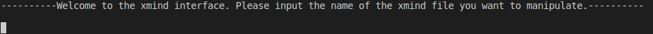
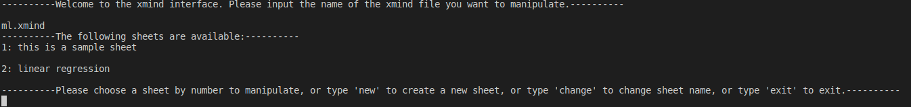
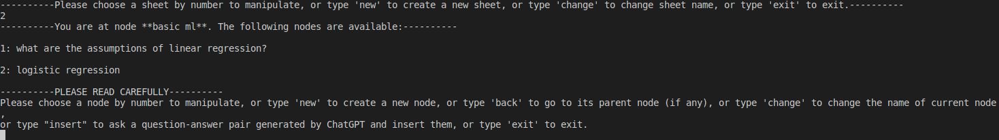
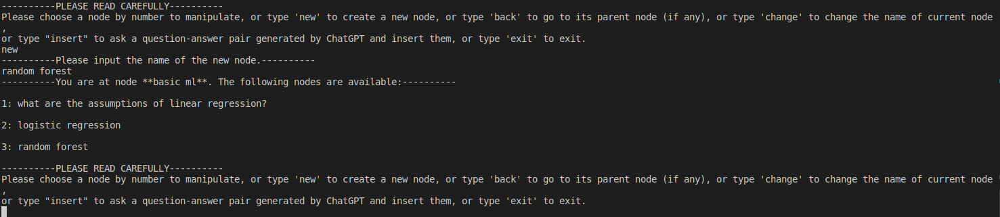
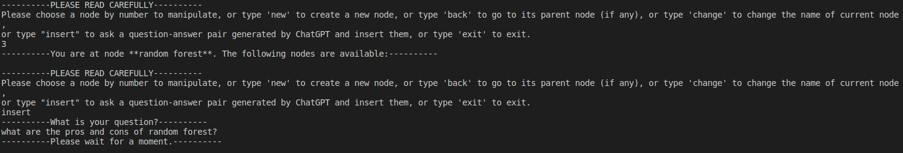
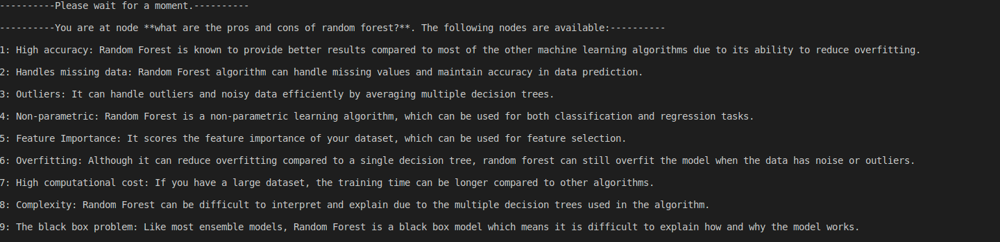
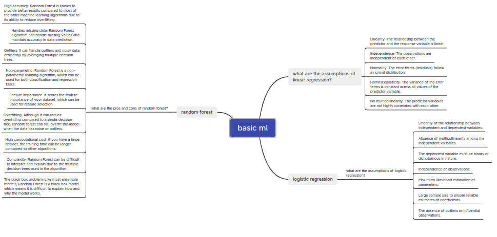

# GPT2XMind
A command line application that can accept users' questions and merge the answers from ChatGPT to a XMind mind map. 


### Intuition

Learning and memorizing knowledge with complex structures is always a tough process. Take the preparation of technical interviews for Data Science/Computer Science positions as an example, students are required to memorize knowledge from multiple sub-disciplines including Operating System, Databases, Data Structures and Algorithms, Computer Architecture…in order to be well prepared for the potential interview questions. Meanwhile, each of the sub-disciplines contains hundreds of details to understand and recite. 

A well-developed mind map will definitely assist students to gain an overview of the knowledge structure, and thus help students to recite them. But constructing a mind map is a time consuming task with lots of time spent on searching and typing relevant texts. Recently, the publication of ChatGPT enables fast search with sophisticated responses. It would be desirable to get ChatGPT encapsulated into an automatic mind map building process.


### Dev Env

Ubuntu 20.04


### Requirements

Python >= 3.8

openai >= 0.27.2

XMind >= 1.2.0

XMind application (recommend XMind <= XMind 8 Build 3, pay attention not to save file in application with XMind >= XMind 2021)


### Installation

First clone this repo by 

```shell
git clone https://github.com/TaikiShuttle/GPT2XMind.git
```

Install the requirements

```shell
pip install openai
pip install XMind
```

apply for an api key at <a href = " https://openai.com/api/">openai</a>. Copy and paste the api key to `answer_getting.py` and fill the key at

```python
openai.api_key = "YOUR KEY HERE"
```

You are now able to create mind map using XMind and ChatGPT! But how to create that?


### How to use

This application uses the command line to interact with the user. User will just follow the choices listed by the application and type in corresponding command to accomplish manipulations including **insert, delete, change**.

In the command line, use

```shell
python run.py
```

to start the application, and you will be in the greeting page



type in the name of `.xmind` file to open an existing file. If the file name does not exist, a new file will be created.


User will then choose/create a sheet he/she want to manipulate by typing corresponding command




After choosing/creating the sheet, the user will enter the root node of that sheet. Note that the root node will be set to default value if a new sheet is created. User can choose multiple manipulations including **insert, delete, change, navigate, insert question-answer pair generated by ChatGPT**.




For example, user create a new node with value "random forest"




The user can then navigate to that point and insert a question-answer pair generated by ChatGPT regarding Random Forest.




After a while, the application will insert the question-answer pair, and navigate to that node for you.




To save the changes, the user have to go to the choosing sheet page and enter "save".


Now use the XMind application to view the mind map we just created!




### Future Development

Currently the application runs only in the command line. A well-designed user interface that can both interact with user and instantly show the mind map would be the further development.

